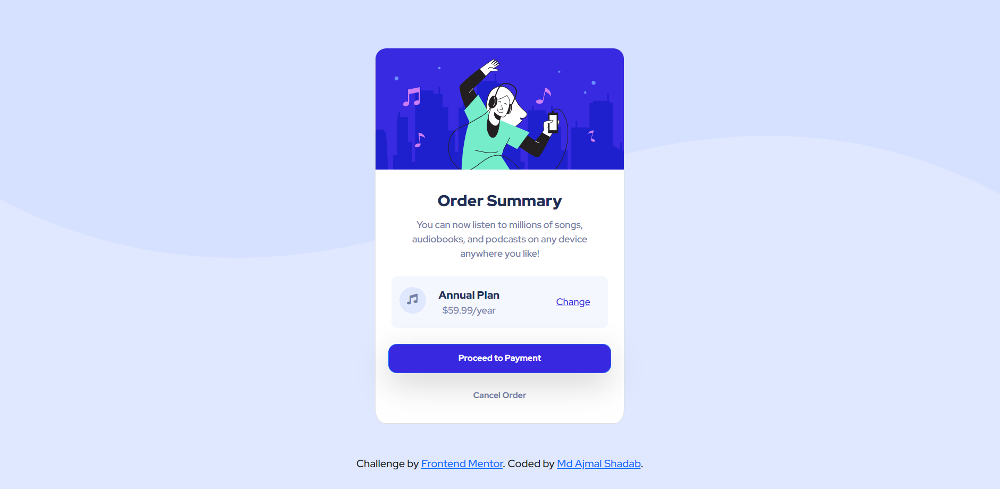

# Frontend Mentor - Order summary card solution

This is a solution to the [Order summary card challenge on Frontend Mentor](https://www.frontendmentor.io/challenges/order-summary-component-QlPmajDUj). Frontend Mentor challenges help you improve your coding skills by building realistic projects. 

## Table of contents

- [Overview](#overview)
  - [The challenge](#the-challenge)
  - [Screenshot](#screenshot)
  - [Links](#links)
- [My process](#my-process)
  - [Built with](#built-with)
  - [What I learned](#what-i-learned)

## Overview

### The challenge

Users should be able to:

- View the optimal layout depending on their device's screen size

### Screenshot

### Links

- [Solution URL](https://github.com/mdajmalshadab/Front-End-Projects/tree/Practice-Projects/1.%20Order-Summary)
- [Live Site URL](https://mdajmalshadab.github.io/Front-End-Projects/1.%20Order-Summary/index.html)

## My process

### Built with

- HTML5
- CSS
- Bootstrap Cards

### What I learned

In this challenge I got a better understanding of col-md-6 types of bootstrap classes, which helps in making a responsive website. I learned ways to properly position and adjust background images. I learned different concepts regarding positioning of HTML elements. 
