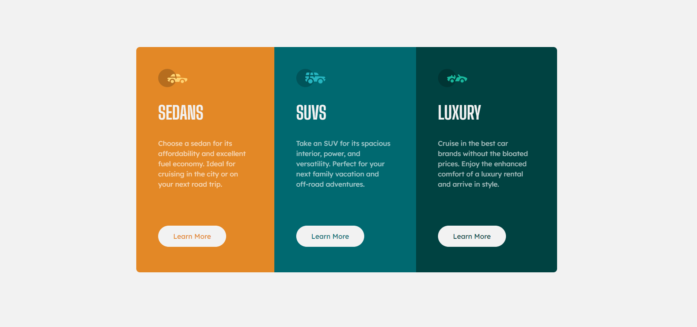

# Frontend Mentor - 3-column preview card component solution

This is a solution to the [3-column preview card component challenge on Frontend Mentor](https://www.frontendmentor.io/challenges/3column-preview-card-component-pH92eAR2-). Frontend Mentor challenges help you improve your coding skills by building realistic projects. 

## Table of contents

- [Overview](#overview)
  - [The challenge](#the-challenge)
  - [Screenshot](#screenshot)
  - [Links](#links)
- [My process](#my-process)
  - [Built with](#built-with)
  - [What I learned](#what-i-learned)

## Overview

### The challenge

Users should be able to:

- View the optimal layout depending on their device's screen size

### Screenshot

### Links

- [Solution URL](https://github.com/mdajmalshadab/Front-End-Projects/tree/Practice-Projects/3-Column-Preview-Card-Component)
- [Live Site URL](https://mdajmalshadab.github.io/Front-End-Projects/3-Column-Preview-Card-Component/index.html)

## My process

### Built with

- HTML5
- CSS
- Bootstrap 
- Flexbox

### What I learned

It was an easy one, similar to the previous challenges by frontend mentor, here in this challenge I learned about bootstrap buttons.
