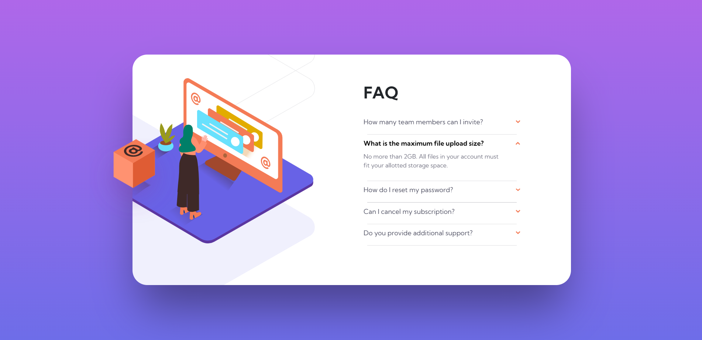

# Frontend Mentor - FAQ accordion card solution

This is a solution to the [FAQ accordion card challenge on Frontend Mentor](https://www.frontendmentor.io/challenges/faq-accordion-card-XlyjD0Oam). Frontend Mentor challenges help you improve your coding skills by building realistic projects. 

## Table of contents

- [Overview](#overview)
  - [The challenge](#the-challenge)
  - [Screenshot](#screenshot)
  - [Links](#links)
- [My process](#my-process)
  - [Built with](#built-with)
  - [What I learned](#what-i-learned)

## Overview

### The challenge

Users should be able to:

- View the optimal layout depending on their device's screen size

### Screenshot

### Links

- [Solution URL](https://github.com/mdajmalshadab/Front-End-Projects/tree/Practice-Projects/5-Faq-Accordion-Card-Main)
- [Live Site URL](https://mdajmalshadab.github.io/Front-End-Projects/5-Faq-Accordion-Card-Main/index.html#default)

## My process

### Built with

- HTML5
- CSS
- Bootstrap 
- Flexbox
- Mobile-first workflow
- Javascript

### What I learned

This was a tricky one, quite challenging for me, learned a lot, learned about creating drop down box(accordian) using id:target approach (got help from a youtube video), I also cleared my concept regarding background-image property of css, got better understanding of flex display and proper positioning techniques to make my website more responsive. I also learnt little bit about CSS animation and tried it over the box.
