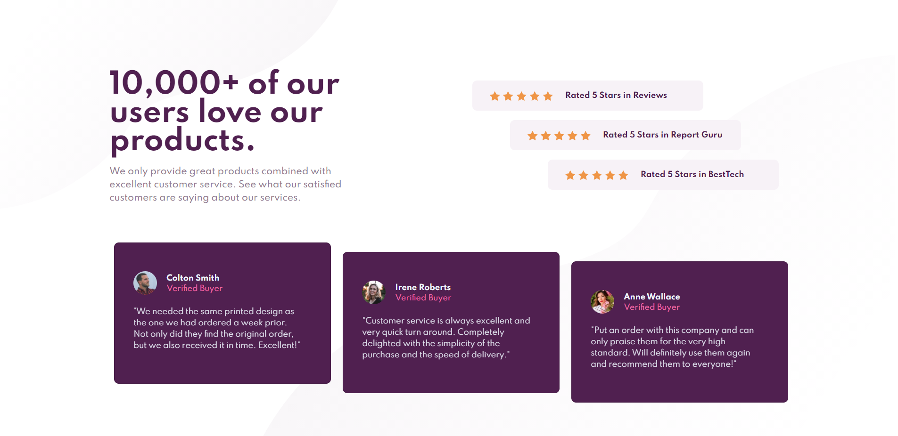

# Frontend Mentor - Social proof section solution

This is a solution to the [Social proof section challenge on Frontend Mentor](https://www.frontendmentor.io/challenges/social-proof-section-6e0qTv_bA). Frontend Mentor challenges help you improve your coding skills by building realistic projects. 

## Table of contents

- [Overview](#overview)
  - [The challenge](#the-challenge)
  - [Screenshot](#screenshot)
  - [Links](#links)
- [My process](#my-process)
  - [Built with](#built-with)
  - [What I learned](#what-i-learned)

## Overview

### The challenge

Users should be able to:

- View the optimal layout depending on their device's screen size

### Screenshot

### Links

- [Solution URL](https://github.com/mdajmalshadab/Front-End-Projects/tree/Practice-Projects/6-social-proof-section-master)
- [Live Site URL](https://mdajmalshadab.github.io/Front-End-Projects/6-social-proof-section-master/index.html)

## My process

### Built with

- HTML5
- CSS
- Bootstrap 
- Flexbox

### What I learned

In this challenge I cleared my concepts regarding flexibility of the website. The rest was easy.
